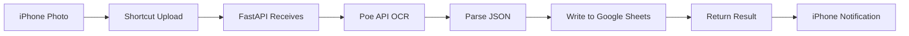

# 📇 AI Business Card OCR Service

**Automated Business Card Scanning & Data Management System**

Scan business cards with iPhone, automatically extract information using AI, and save to Google Sheets.

[](https://www.python.org/)
[](https://fastapi.tiangolo.com/)
[](LICENSE)

---

## ✨ Features

- 📱 **iPhone Shortcuts Integration** - One-tap photo capture and automatic upload
- 🤖 **AI-Powered Recognition** - OCR using Gemini 2.5 Flash model
- 📊 **Multi-Card Support** - Recognize multiple business cards in a single photo
- 📝 **Auto-Save** - Results automatically written to Google Sheets
- ⚡ **Real-Time Processing** - Fast response, average processing time 5-10 seconds
- 🔒 **Secure & Reliable** - Sensitive information excluded from Git

---

## 📸 Demo

### iPhone Shortcuts Workflow
```
1. Open "Scan Business Card" shortcut
2. Take a photo of business card(s)
3. Automatic upload and recognition
4. Check results in Google Sheets
```

### Recognized Fields
- 👤 Name
- 🏢 Company
- 💼 Title
- 📱 Mobile Phone
- ☎️ Office Phone
- 📧 Email
- 🌐 Website
- 📍 Address
- ⏰ Timestamp

---

## 🚀 Quick Start

### 1️⃣ Prerequisites

- Python 3.9 or higher
- iPhone (iOS 14+)
- Google Account
- Poe API Account (paid service required)
- ngrok Account (free tier available)

### 2️⃣ Installation

#### Step 1: Clone Repository
```bash
git clone https://github.com/erickh826/AI-Business-Card-OCR-Service.git
cd AI-Business-Card-OCR-Service
```

#### Step 2: Install Python Packages
```bash
pip install -r requirements.txt
```

#### Step 3: Configure Environment Variables
Create `.env` file:
```bash
# Poe API Token
POE_API_TOKEN=poe-xxxxxxxxxxxxxxxxxxxxxxxxxxxxxxxx

# Google Sheets Configuration
GOOGLE_SHEET_ID=your_spreadsheet_id_here
GOOGLE_SHEET_NAME=Sheet1
```

#### Step 4: Setup Google Sheets API
1. Follow [`SETUP_EN.md`](SETUP_EN.md) to obtain Service Account credentials
2. Download `credentials.json` and place it in project root directory
3. Add Service Account email to Google Sheets with Editor permission

#### Step 5: Configure ngrok
```bash
# Set authtoken (one-time setup)
ngrok config add-authtoken YOUR_AUTHTOKEN_HERE
```

For detailed setup instructions:
- English: [SETUP_EN.md](SETUP_EN.md)
- 中文版: [SETUP.md](SETUP.md)

### 3️⃣ Start Service

#### Terminal 1: Start FastAPI Service
```bash
uvicorn main:app --reload --host 0.0.0.0 --port 8000
```

#### Terminal 2: Start ngrok
```bash
ngrok http 8000
```

Note the ngrok URL, for example:
```
https://xxxx-xxx-xxx-xxx-xxx.ngrok-free.app
```

---

## 📱 iPhone Shortcuts Setup

### Complete Setup Steps

#### 1. Open iPhone "Shortcuts" App

#### 2. Create New Shortcut
- Tap "+" in the top right corner
- Tap "Add Action"

#### 3. First Action: Take Photo
```
Search for "Take Photo" → Select "Take Photo"
Settings:
  ✅ Show Camera Preview
```

#### 4. Second Action: Get Contents of URL
```
Search for "Get Contents of URL" → Select "Get Contents of URL"

Settings:
┌─────────────────────────────────────┐
│ URL                                 │
│ https://your-ngrok-url.ngrok-free.app/ocr/business-card
└─────────────────────────────────────┘

┌─────────────────────────────────────┐
│ Method: POST                        │
└─────────────────────────────────────┘

┌─────────────────────────────────────┐
│ Request Body: Form                  │
│                                     │
│ ┌───────────────────────────────┐  │
│ │ file (File)                    │  │
│ │ └→ Photo (from previous step) │  │
│ └───────────────────────────────┘  │
└─────────────────────────────────────┘
```

**Important Notes:**
- ✅ Request Body must be "**Form**" (not "File" or "JSON")
- ✅ Field name must be `file` (lowercase)
- ✅ Type must be "File"
- ✅ Value must be linked to "Photo" variable

#### 5. Third Action (Optional): Show Result
```
Search for "Show Notification" → Select "Show Notification"

Settings:
┌─────────────────────────────────────┐
│ ✅ Business card scan completed!    │
└─────────────────────────────────────┘
```

#### 6. Save Shortcut
- Tap "Done" in the top right corner
- Name it "**Scan Business Card**"
- (Optional) Tap "⋯" → "Add to Home Screen"

### Shortcut Flow Diagram

```
┌─────────────────┐
│  Tap Shortcut   │
└────────┬────────┘
         │
         ▼
┌─────────────────┐
│ Take Photo      │
│ (Camera Preview)│
└────────┬────────┘
         │
         ▼
┌─────────────────┐
│ Upload to API   │
│ (POST /ocr/...) │
└────────┬────────┘
         │
         ▼
┌─────────────────┐
│ AI Recognition  │
│ (Gemini 2.5)    │
└────────┬────────┘
         │
         ▼
┌─────────────────┐
│ Write to Google │
│ Sheets          │
└────────┬────────┘
         │
         ▼
┌─────────────────┐
│ Show Result     │
│ ✅ Complete!    │
└─────────────────┘
```

### Troubleshooting

#### ❌ Error: 422 Unprocessable Content
**Cause:** Incorrect Request Body configuration
**Solution:**
1. Ensure "Request Body" is set to "**Form**"
2. Verify field name is `file` (lowercase)
3. Confirm type is "File"

#### ❌ Error: 404 Not Found
**Cause:** Incorrect URL path
**Solution:**
1. Ensure URL includes `/ocr/business-card`
2. Check spelling is correct (ocr not oct)

#### ❌ Error: Connection Failed
**Cause:** ngrok not running or URL expired
**Solution:**
1. Verify ngrok is running
2. Check ngrok URL is correct (changes on each restart)
3. Update URL in shortcut

---

## 🏗️ Project Structure

```
AI-Business-Card-OCR-Service/
├── main.py                      # FastAPI main application
├── ocr_service.py               # OCR recognition logic
├── google_sheets_handler.py     # Google Sheets integration
├── requirements.txt             # Python package requirements
├── .env                         # Environment variables (not in Git)
├── credentials.json             # Google API credentials (not in Git)
├── .gitignore                   # Git ignore file settings
├── README.md                    # Project documentation (this file)
├── README_ZH.md                 # 專案說明 (中文版)
├── SETUP.md                     # 詳細設定指南 (中文)
├── SETUP_EN.md                  # Detailed Setup Guide (English)
├── task.md                      # 專案任務規劃 (中文)
└── task_EN.md                   # Project Tasks (English)
```

---

## 🔧 API Documentation

### Endpoints

#### 1. POST `/ocr/business-card`
Upload business card image for OCR recognition

**Request:**
```bash
curl -X POST "http://localhost:8000/ocr/business-card" \
  -F "file=@business_card.jpg"
```

**Response (Success):**
```json
{
  "status": "success",
  "message": "Successfully processed 2 business card(s)",
  "cards_count": 2,
  "data": [
    {
      "name": "John Doe",
      "company": "Tech Company",
      "title": "CEO",
      "phone_mobile": "0912-345-678",
      "phone_office": "02-1234-5678",
      "email": "john@example.com",
      "website": "https://example.com",
      "address": "123 Main Street, Taipei"
    }
  ],
  "saved_to_sheet": true
}
```

#### 2. GET `/health`
Health check endpoint

**Response:**
```json
{
  "status": "healthy",
  "services": {
    "api": "running",
    "poe_api_configured": true,
    "google_sheets_configured": true
  }
}
```

#### 3. GET `/docs`
Swagger UI interactive API documentation
```
http://localhost:8000/docs
```

---

## 📦 Tech Stack

### Backend
- **Framework:** FastAPI 0.124.0
- **AI Model:** Gemini 2.5 Flash (via Poe API)
- **Database:** Google Sheets API
- **Server:** Uvicorn 0.38.0

### Frontend
- **Platform:** iPhone Shortcuts App
- **Tunnel:** ngrok (for development)

### Key Packages
```
fastapi==0.124.0              # Web framework
fastapi-poe==0.0.81           # Poe API client
google-api-python-client==2.175.0  # Google Sheets API
nest-asyncio==1.6.0           # Async support
python-dotenv==1.2.1          # Environment variables
uvicorn==0.38.0               # ASGI server
```

---

## 🧪 Testing

### Test Google Sheets Connection
```bash
python google_sheets_handler.py
```

### Test OCR Functionality
```bash
python ocr_service.py
```

### Test API Endpoints
```bash
# Start service
uvicorn main:app --reload

# Use Swagger UI
Open browser: http://localhost:8000/docs

# Or use curl
curl -X POST "http://localhost:8000/ocr/business-card" \
  -F "file=@test_card.jpg"
```

---

## 📊 Workflow



---

## ⚙️ Development Setup

### Local Development
```bash
# 1. Install dependencies
pip install -r requirements.txt

# 2. Configure environment variables
cp .env.example .env
# Edit .env and add your API keys

# 3. Start development server
uvicorn main:app --reload

# 4. Start ngrok (in another terminal)
ngrok http 8000
```

### Auto-Reload
FastAPI development mode supports auto-reload, the service will automatically restart after code changes.

---

## 🔒 Security

### Implemented Security Measures
- ✅ Environment variable management (`.env`)
- ✅ Sensitive files excluded from Git (`.gitignore`)
- ✅ CORS configuration (can restrict origins)
- ✅ File type validation
- ✅ Automatic temporary file cleanup

### Recommended Additional Measures
- 🔐 Add API Key authentication
- 🔐 Use HTTPS (production environment)
- 🔐 Configure rate limiting
- 🔐 Access logging

---

## 📈 Advanced Features

### Implemented Features
- [x] Multi-card recognition in single photo
- [x] Automatic timestamp
- [x] Batch write to Google Sheets
- [x] Error handling and reporting
- [x] iPhone Shortcuts integration

### Future Plans
- [ ] Deploy to cloud platform (Vercel/Heroku)
- [ ] Business card image storage
- [ ] Recognition history query
- [ ] Multi-language support (English, Japanese, etc.)
- [ ] Batch upload functionality

---

## 🤝 Contributing

Issues and Pull Requests are welcome!

1. Fork this repository
2. Create feature branch (`git checkout -b feature/AmazingFeature`)
3. Commit changes (`git commit -m 'Add some AmazingFeature'`)
4. Push to branch (`git push origin feature/AmazingFeature`)
5. Open Pull Request

---

## 📝 License

This project is licensed under the MIT License - see [LICENSE](LICENSE) file for details

---

## 🙏 Acknowledgments

- **Poe** - Providing AI API services
- **Google** - Google Sheets API
- **FastAPI** - Excellent web framework
- **ngrok** - Development tunneling tool

---

## 📞 Contact

- **GitHub:** [@erickh826](https://github.com/erickh826)
- **Project Link:** [AI-Business-Card-OCR-Service](https://github.com/erickh826/AI-Business-Card-OCR-Service)

---

## 🌟 Star History

If this project helps you, please give it a ⭐️ Star!

---

## 🎯 Use Cases

### Perfect For:
- 📊 **Sales & Business Development** - Quickly digitize contacts from networking events
- 🏢 **HR & Recruitment** - Organize candidate information efficiently
- 📱 **Event Management** - Manage conference attendee contacts
- 🤝 **Networking** - Never lose a business card again

### Multi-Card Recognition Scenarios:
- Conference tables with multiple business cards
- Post-meeting batch processing
- Exhibition booth contact collection
- Team contact sharing

---

## 💡 LinkedIn Post Template

```
🚀 Excited to share my latest project: AI Business Card OCR Service!

📱 Problem: Manually typing business card information is time-consuming and error-prone.

💡 Solution: One-tap iPhone shortcut that:
✅ Captures photos of business cards
✅ Uses Gemini 2.5 Flash AI for OCR
✅ Automatically saves to Google Sheets
✅ Supports multiple cards in one photo!

🔧 Tech Stack:
• Python FastAPI backend
• Gemini 2.5 Flash via Poe API
• Google Sheets API integration
• iPhone Shortcuts for seamless UX

⚡ Results: 5-10 second processing time, perfect accuracy for English & Chinese cards.

Check out the full project on GitHub: [link]

#AI #OCR #Automation #Python #FastAPI #ProductivityTools #OpenSource
```

---

**Made with ❤️ by [erickh826](https://github.com/erickh826)**
