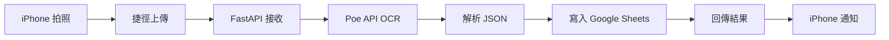

# 📇 AI Business Card OCR Service

**自動化名片掃描與資料管理系統 | Automated Business Card Scanning & Data Management System**

使用 iPhone 拍照，透過 AI 自動辨識名片資訊，並儲存至 Google Sheets。  
Scan business cards with iPhone, automatically extract information using AI, and save to Google Sheets.

[](https://www.python.org/)
[](https://fastapi.tiangolo.com/)
[](LICENSE)

---

## ✨ 功能特色 | Features

- 📱 **iPhone 捷徑整合** - 一鍵拍照並自動上傳
- 🤖 **AI 智能辨識** - 使用 Gemini 2.5 Flash 模型進行 OCR
- 📊 **多張名片支援** - 單張圖片可同時辨識多張名片
- 📝 **自動化儲存** - 結果自動寫入 Google Sheets
- ⚡ **即時處理** - 快速回應，平均處理時間 5-10 秒
- 🔒 **安全可靠** - 敏感資訊不上傳至 Git

---

## 📸 Demo

### iPhone 捷徑使用流程
```
1. 開啟「掃描名片」捷徑
2. 拍攝名片照片
3. 自動上傳並辨識
4. 查看 Google Sheets 結果
```

### 辨識欄位 | Recognized Fields
- 👤 姓名 (Name)
- 🏢 公司 (Company)
- 💼 職稱 (Title)
- 📱 手機 (Mobile Phone)
- ☎️ 辦公室電話 (Office Phone)
- 📧 電子郵件 (Email)
- 🌐 網站 (Website)
- 📍 地址 (Address)
- ⏰ 時間戳記 (Timestamp)

---

## 🚀 快速開始 | Quick Start

### 1️⃣ 環境需求 | Prerequisites

- Python 3.9 或更高版本
- iPhone (iOS 14+)
- Google 帳號
- Poe API 帳號（需付費）
- ngrok 帳號（免費版即可）

### 2️⃣ 安裝步驟 | Installation

#### Step 1: Clone 專案
```bash
git clone https://github.com/erickh826/AI-Business-Card-OCR-Service.git
cd AI-Business-Card-OCR-Service
```

#### Step 2: 安裝 Python 套件
```bash
pip install -r requirements.txt
```

#### Step 3: 設定環境變數
建立 `.env` 檔案：
```bash
# Poe API Token
POE_API_TOKEN=poe-xxxxxxxxxxxxxxxxxxxxxxxxxxxxxxxx

# Google Sheets Configuration
GOOGLE_SHEET_ID=your_spreadsheet_id_here
GOOGLE_SHEET_NAME=Sheet1
```

#### Step 4: 設定 Google Sheets API
1. 參考 [`SETUP.md`](SETUP.md) 或 [`SETUP_EN.md`](SETUP_EN.md) 取得 Service Account 憑證
2. 下載 `credentials.json` 並放置於專案根目錄
3. 將 Service Account email 加入 Google Sheets 編輯權限

#### Step 5: 設定 ngrok
```bash
# 設定 authtoken (只需執行一次)
ngrok config add-authtoken YOUR_AUTHTOKEN_HERE
```

詳細設定說明請參考：
- 中文版：[SETUP.md](SETUP.md)
- English: [SETUP_EN.md](SETUP_EN.md)

### 3️⃣ 啟動服務 | Start Service

#### 終端 1: 啟動 FastAPI 服務
```bash
uvicorn main:app --reload --host 0.0.0.0 --port 8000
```

#### 終端 2: 啟動 ngrok
```bash
ngrok http 8000
```

記下 ngrok 提供的 URL，例如：
```
https://xxxx-xxx-xxx-xxx-xxx.ngrok-free.app
```

---

## 📱 iPhone 捷徑設定 | iPhone Shortcuts Setup

### 完整設定步驟

#### 1. 開啟 iPhone「捷徑」App

#### 2. 建立新捷徑
- 點擊右上角「+」
- 點擊「新增動作」

#### 3. 第一個動作：拍照
```
搜尋「拍照」→ 選擇「拍照」
設定：
  ✅ 顯示相機預覽
```

#### 4. 第二個動作：取得 URL 的內容
```
搜尋「取得 URL 的內容」→ 選擇「取得 URL 的內容」

設定：
┌─────────────────────────────────────┐
│ URL                                 │
│ https://your-ngrok-url.ngrok-free.app/ocr/business-card
└─────────────────────────────────────┘

┌─────────────────────────────────────┐
│ 方式: POST                          │
└─────────────────────────────────────┘

┌─────────────────────────────────────┐
│ 要求本文: 表單                      │
│                                     │
│ ┌───────────────────────────────┐  │
│ │ file (檔案)                    │  │
│ │ └→ 照片 (從上一步)             │  │
│ └───────────────────────────────┘  │
└─────────────────────────────────────┘
```

**重要提醒：**
- ✅ 要求本文選擇「**表單**」（不是「檔案」或「JSON」）
- ✅ 欄位名稱必須是 `file`（小寫）
- ✅ 類型選擇「檔案」
- ✅ 值連接到「照片」變數

#### 5. 第三個動作（可選）：顯示結果
```
搜尋「顯示通知」→ 選擇「顯示通知」

設定：
┌─────────────────────────────────────┐
│ ✅ 名片掃描完成！                   │
└─────────────────────────────────────┘
```

#### 6. 儲存捷徑
- 點擊右上角「完成」
- 命名為「**掃描名片**」
- （可選）點擊「⋯」→「加入主畫面」

### 捷徑流程圖

```
┌─────────────────┐
│   點擊捷徑      │
└────────┬────────┘
         │
         ▼
┌─────────────────┐
│   拍攝名片      │
│   (相機預覽)    │
└────────┬────────┘
         │
         ▼
┌─────────────────┐
│ 上傳至後端 API  │
│ (POST /ocr/...)  │
└────────┬────────┘
         │
         ▼
┌─────────────────┐
│   AI 辨識處理   │
│ (Gemini 2.5)     │
└────────┬────────┘
         │
         ▼
┌─────────────────┐
│ 寫入 Google     │
│ Sheets          │
└────────┬────────┘
         │
         ▼
┌─────────────────┐
│   顯示通知      │
│   ✅ 完成！     │
└─────────────────┘
```

### 疑難排解 | Troubleshooting

#### ❌ 錯誤：422 Unprocessable Content
**原因：** 要求本文設定錯誤
**解決方法：**
1. 檢查「要求本文」是否選擇「**表單**」
2. 確認欄位名稱為 `file`（小寫）
3. 確認類型為「檔案」

#### ❌ 錯誤：404 Not Found
**原因：** URL 路徑錯誤
**解決方法：**
1. 確認 URL 包含 `/ocr/business-card`
2. 檢查拼寫是否正確（ocr 不是 oct）

#### ❌ 錯誤：Connection Failed
**原因：** ngrok 未啟動或 URL 過期
**解決方法：**
1. 確認 ngrok 正在運行
2. 檢查 ngrok URL 是否正確（每次重啟會改變）
3. 更新捷徑中的 URL

---

## 🏗️ 專案架構 | Project Structure

```
AI-Business-Card-OCR-Service/
├── main.py                      # FastAPI 主程式
├── ocr_service.py               # OCR 辨識邏輯
├── google_sheets_handler.py     # Google Sheets 整合
├── requirements.txt             # Python 套件需求
├── .env                         # 環境變數 (不提交至 Git)
├── credentials.json             # Google API 憑證 (不提交至 Git)
├── .gitignore                   # Git 忽略檔案設定
├── README.md                    # 專案說明 (中文版)
├── README_EN.md                 # Project Documentation (English)
├── SETUP.md                     # 詳細設定指南 (中文)
├── SETUP_EN.md                  # Setup Guide (English)
├── task.md                      # 專案任務規劃 (中文)
└── task_EN.md                   # Project Tasks (English)
```

---

## 🔧 API 說明 | API Documentation

### Endpoints

#### 1. POST `/ocr/business-card`
上傳名片圖片進行 OCR 辨識

**Request:**
```bash
curl -X POST "http://localhost:8000/ocr/business-card" \
  -F "file=@business_card.jpg"
```

**Response (Success):**
```json
{
  "status": "success",
  "message": "Successfully processed 2 business card(s)",
  "cards_count": 2,
  "data": [
    {
      "name": "張三",
      "company": "科技公司",
      "title": "總經理",
      "phone_mobile": "0912-345-678",
      "phone_office": "02-1234-5678",
      "email": "zhang@example.com",
      "website": "https://example.com",
      "address": "台北市信義區信義路五段7號"
    }
  ],
  "saved_to_sheet": true
}
```

#### 2. GET `/health`
健康檢查端點

**Response:**
```json
{
  "status": "healthy",
  "services": {
    "api": "running",
    "poe_api_configured": true,
    "google_sheets_configured": true
  }
}
```

#### 3. GET `/docs`
Swagger UI 互動式 API 文件
```
http://localhost:8000/docs
```

---

## 📦 技術棧 | Tech Stack

### 後端 | Backend
- **Framework:** FastAPI 0.124.0
- **AI Model:** Gemini 2.5 Flash (via Poe API)
- **Database:** Google Sheets API
- **Server:** Uvicorn 0.38.0

### 前端 | Frontend
- **Platform:** iPhone Shortcuts App
- **Tunnel:** ngrok (for development)

### 主要套件 | Key Packages
```
fastapi==0.124.0              # Web framework
fastapi-poe==0.0.81           # Poe API client
google-api-python-client==2.175.0  # Google Sheets API
nest-asyncio==1.6.0           # Async support
python-dotenv==1.2.1          # Environment variables
uvicorn==0.38.0               # ASGI server
```

---

## 🧪 測試 | Testing

### 測試 Google Sheets 連線
```bash
python google_sheets_handler.py
```

### 測試 OCR 功能
```bash
python ocr_service.py
```

### 測試 API 端點
```bash
# 啟動服務
uvicorn main:app --reload

# 使用 Swagger UI
開啟瀏覽器：http://localhost:8000/docs

# 或使用 curl
curl -X POST "http://localhost:8000/ocr/business-card" \
  -F "file=@test_card.jpg"
```

---

## 📊 使用流程 | Workflow



---

## ⚙️ 開發環境設定 | Development Setup

### 本地開發
```bash
# 1. 安裝依賴
pip install -r requirements.txt

# 2. 設定環境變數
cp .env.example .env
# 編輯 .env 填入您的 API 金鑰

# 3. 啟動開發伺服器
uvicorn main:app --reload

# 4. 啟動 ngrok (另開終端)
ngrok http 8000
```

### 自動重載
FastAPI 開發模式支援自動重載，修改程式碼後會自動重啟服務。

---

## 🔒 安全性 | Security

### 已實作的安全措施
- ✅ 環境變數管理（`.env`）
- ✅ 敏感檔案不上傳 Git（`.gitignore`）
- ✅ CORS 設定（可限制來源）
- ✅ 檔案類型驗證
- ✅ 臨時檔案自動清理

### 建議的額外措施
- 🔐 加入 API Key 認證
- 🔐 使用 HTTPS（生產環境）
- 🔐 設定請求速率限制
- 🔐 記錄存取日誌

---

## 📈 進階功能 | Advanced Features

### 已支援功能
- [x] 多張名片同時辨識
- [x] 自動時間戳記
- [x] 批次寫入 Google Sheets
- [x] 錯誤處理與回報
- [x] iPhone 捷徑整合

### 未來規劃
- [ ] 部署至雲端平台 (Vercel/Heroku)
- [ ] 名片圖片儲存功能
- [ ] 辨識歷史記錄查詢
- [ ] 多語言支援（英文、日文等）
- [ ] 批次上傳功能

---
## 🎯 使用場景 | Use Cases

### 適用對象：
- 📊 **業務與商業開發** - 快速數位化社交活動的聯絡資訊
- 🏢 **人資與招募** - 有效整理應徵者資料
- 📱 **活動管理** - 管理會議參與者聯絡方式
- 🤝 **社交網絡** - 再也不會遺失名片

### 多張名片辨識場景：
- 會議桌上的多張名片
- 會後批次處理
- 展覽攤位聯絡人收集
- 團隊聯絡資訊分享

---

## 💡 LinkedIn 貼文範本

```
🚀 很興奮分享我的最新專案：AI 名片 OCR 服務！

📱 問題：手動輸入名片資訊既耗時又容易出錯。

💡 解決方案：一鍵 iPhone 捷徑，可以：
✅ 拍攝名片照片
✅ 使用 Gemini 2.5 Flash AI 進行 OCR
✅ 自動儲存至 Google Sheets
✅ 支援一張照片辨識多張名片！

🔧 技術棧：
• Python FastAPI 後端
• 透過 Poe API 使用 Gemini 2.5 Flash
• Google Sheets API 整合
• iPhone 捷徑打造無縫使用體驗

⚡ 成果：5-10 秒處理時間，中英文名片皆完美辨識。

在 GitHub 查看完整專案：[連結]

#AI #OCR #自動化 #Python #FastAPI #生產力工具 #開源
```

中文版範本：
```
🚀 分享我的最新 Side Project！

用 iPhone 一鍵掃描名片，AI 自動辨識並存入 Google Sheets 📱✨

🎯 核心功能：
• 支援多張名片同時辨識
• Gemini 2.5 Flash AI 驅動
• 5-10 秒完成處理
• 自動加上時間戳記

💻 技術亮點：
• FastAPI 非同步架構
• Poe API 整合
• iPhone 捷徑無縫體驗
• 完整開源文件

非常適合業務、人資、活動管理使用！

GitHub: https://github.com/erickh826/AI-Business-Card-OCR-Service

#人工智慧 #OCR辨識 #自動化 #Python開發 #生產力工具 #SideProject
```

---

## 🤝 貢獻 | Contributing
## 🤝 貢獻 | Contributing

歡迎提交 Issue 或 Pull Request！

1. Fork 本專案
2. 建立功能分支 (`git checkout -b feature/AmazingFeature`)
3. 提交變更 (`git commit -m 'Add some AmazingFeature'`)
4. 推送至分支 (`git push origin feature/AmazingFeature`)
5. 開啟 Pull Request

---

## 📝 授權 | License

本專案採用 MIT 授權條款 - 詳見 [LICENSE](LICENSE) 檔案

---

## 🙏 致謝 | Acknowledgments

- **Poe** - 提供 AI API 服務
- **Google** - Google Sheets API
- **FastAPI** - 優秀的 Web 框架
- **ngrok** - 開發環境穿透工具

---

## 📞 聯絡方式 | Contact

- **GitHub:** [@erickh826](https://github.com/erickh826)
- **Project Link:** [AI-Business-Card-OCR-Service](https://github.com/erickh826/AI-Business-Card-OCR-Service)

---

## 🌟 Star History

如果這個專案對您有幫助，請給個 ⭐️ Star！

---

**Made with ❤️ by [erickh826](https://github.com/erickh826)**
